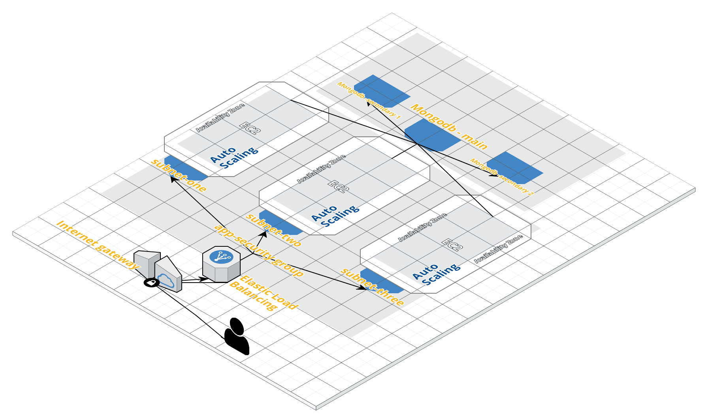

# Multi Availability Zones

## Aim:
- Using Terraform and AWS create a load balanced and auto scaled 2 tier architecture for the node example application.
- The Architecture should be a "Highly Available" application.
- Meaning that it has redundancies across all three availability zones. The application should connect to a single database instance.

## Application Load Balancer
- Best suited for load balancing of HTTP and HTTPS traffic
- Provides advanced request routing targeted at the delivery of modern application architectures

### Components:

#### Load Balancer
- Serves as the single point of contact for clients
- Distributes incoming application traffic across multiple targets, in multiple Availability Zones
- Increases availability of your application

#### Listener
- Check for connection requests from clients, using the configured protocol and port

#### Target group
- Routes requests to one or more registered targets, using the specified protocol and port
- Health check can also be configured

## Auto Scaling
- Ensures you have the correct number of EC2 instances avilable to handle the load of your application

## Highly Available application
- Creating your architecture in such a way that your 'system' is always available - or has the least amount of downtime as possible

## Set up
- The load balancer resource is setup to redirect traffic to the app servers that are online. If there is a failure in the main availability zone then the primary app server will fail too. The downtime that will result from this is prevented by the autoscaling group.

- We have created an autoscaling group resource on Terraform. This resource is configured to deploy minimum of 3 and maximum of 6 App instances across three availability zones. This means, in the case of a failure another app instance will get deployed and replaced the one that has failed. This makes our architecture "Highly Available".

 - To allow the spin up of minimum three instances in multiple availability zones, we have created and configured three subnets, each having three route table associations.

# GitHub

### GitHub Approval of Pull Requests

When you've made changes to the code on your personal branch, commit it and
push it to GitHub. From there, go onto your branch on the GitHub repo and
submit a pull request. Select the base to be branch below yours, add any
comments and click submit.

This new request may need some approval of your co-workers to add the new code
to the branch below yours. If this is the case, then they can find the new
request in the "Pull Requests" tab on the main page of the repo.

On this tab, there will be an option to add a review. Here, you can add a
comment to the request, suggest changes to the code or approve the pull. Once
enough people have approved the pull, then the person who originally made the
request will be able to complete the pull, if there are no conflicts with the
merge.

### Pull Before Merging
When wanting to make a merge to a lower branch, you should pull from that
branch onto yours before then merging and pushing the changes to GitHub. This
will help prevent merge conflicts that can cause some problems if left
unchecked.
